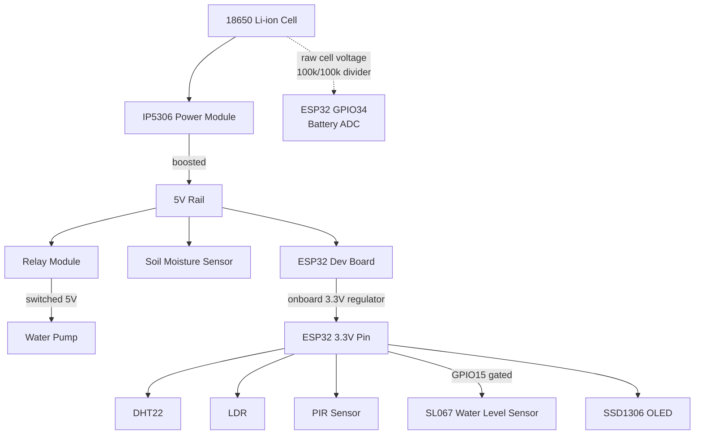

# Smart Vase

An ESP32-powered self-watering plant vase. It monitors soil moisture, light,
temperature/humidity, reservoir level, and battery charge; waters the plant
automatically when it's dry (if it's safe to do so); and exposes a live web
dashboard plus a small OLED status screen. Most of the time it sits in deep
sleep to stretch battery life, waking on a timer or when a PIR sensor detects
someone approaching.

## Hardware

| Component | Use case | Pin(s) |
|---|---|---|
| ESP32 dev board | Main controller — sensor reads, pump control, Wi-Fi dashboard, deep-sleep power management | — |
| IP5306 power module | Charges the 18650 and boosts it to a 5V rail — see [Power architecture](#power-architecture) | — |
| DHT22 | Ambient temperature & humidity | GPIO4 |
| Capacitive soil moisture sensor | Soil moisture % (drives the auto-watering decision) | GPIO35 (analog) |
| LDR (light-dependent resistor) | Ambient light level, shown on the dashboard | GPIO32 (analog) |
| Solu SL067 water level sensor | Reservoir level, graduated 0–100% (see [Water level calibration](#water-level-calibration)) | Signal: GPIO36 (analog), Power: GPIO15 |
| PIR motion sensor | Wakes the device from deep sleep when someone approaches, so the screen lights up on demand | GPIO33 |
| 18650 Li-ion cell + resistor divider (100kΩ/100kΩ) | Battery voltage sensing → percentage estimate. **Must tap the raw cell terminals**, not the IP5306's boosted 5V rail — see [Battery sensing](#battery-sensing) | GPIO34 (analog) |
| Relay module (active-HIGH trigger) driving the water pump | Switches pump power on/off. **Pump is wired to the relay's NO (Normally Open) contact** — see [Relay wiring](#relay-wiring-nc-vs-no) | GPIO26 |
| SSD1306 128x64 I2C OLED | On-device status screen (Wi-Fi/AP state, IP address) | SDA: GPIO21, SCL: GPIO22 (I2C address `0x3C`) |

## Power architecture



- **5V rail** (IP5306 boost output): ESP32 (via its VIN/5V pin), soil moisture
  sensor, relay module, and the pump (switched through the relay).
- **3.3V rail** (the ESP32 board's own onboard regulator output): DHT22, LDR,
  PIR, the SL067 water level sensor (power-gated through GPIO15), and the OLED.
- **Battery ADC divider taps the 18650 directly**, before the IP5306's boost
  stage — see [Battery sensing](#battery-sensing) for why.

> **Known risk:** the IP5306 (like most power-bank ICs) auto-shuts-off its 5V
> output when it detects a "no-load" current draw for ~30–40 seconds — a
> threshold the ESP32's deep-sleep current is almost certainly below. If your
> specific module doesn't have a way to disable that (a solder jumper, or a
> pin held in a certain state — this varies by board), it may cut power to
> the ESP32 every time it enters deep sleep, silently breaking both the timer
> wake and the PIR wake. Worth confirming with a multimeter: put the device
> to sleep and check whether the 5V rail is still alive after ~40 seconds.

> **Check before trusting readings:** the soil moisture sensor is powered
> from the 5V rail, but its analog output feeds GPIO35, which — like every
> ESP32 ADC pin — is only safe up to ~3.3V. If that sensor's output actually
> swings with its 5V supply, you'd risk the same over-voltage clipping (or
> pin stress) we found and fixed on the water level sensor. Verify with a
> multimeter that the signal pin never exceeds ~3.3V before relying on it.

### Relay wiring: NC vs NO

The pump **must** be wired to the relay's **NO (Normally Open)** contact, not NC.
A de-energized (or entirely unpowered) relay always rests on its NC contact —
so if the pump were wired there, it would receive continuous power any time the
load supply is live, regardless of whether the ESP32 is even running (e.g.
during boot, or if the controller loses power entirely). Wiring the pump to NO
means the default, unpowered state is pump-off (fail-safe), and the firmware
only closes the contact when it deliberately energizes the relay to water the
plant.

### Battery sensing

`PowerManager::getBatteryPercent()` uses a discharge curve calibrated for a
**single 18650 cell** (3.00V = empty, 4.20V = full). The 100kΩ/100kΩ divider
must be connected directly across the raw battery terminals, before the
IP5306's boost stage. The IP5306's 5V output stays regulated/flat for almost
the entire discharge cycle, which would make this percentage estimate
meaningless if sampled there instead — see the note in
[`config.h`](src/config.h) (`V_BAT_CAL_OFFSET`) if you need to correct for
measured divider error.

### Water level calibration

The SL067 probe outputs an analog signal proportional to how much of it is
submerged, but it has no onboard pull resistor, and GPIO36 (an ESP32
input-only ADC pin) has no internal pull-down either — an external **10kΩ
pull-down resistor** between the signal line and GND is required, otherwise
the reading floats and pins at 4095 regardless of water level. The probe's
power pin must be driven from `PIN_WATER_PWR` (GPIO15, 3.3V logic) rather than
an external 5V rail — feeding 5V into GPIO36 exceeds the ESP32's absolute
maximum pin voltage.

Once wired correctly, calibrate it by watching the serial log
(`Water level raw ADC: X -> Y%`) with the reservoir empty and with the probe
fully submerged, then send both raw values to the device:

```bash
curl -X POST http://<vase-ip>/api/calibrate/water \
  -H "Content-Type: application/json" \
  -d "{\"empty\":0,\"full\":1285}"
```

This is stored in NVS and persists across reboots. `WATER_EMPTY_PCT_THRESHOLD`
in `config.h` (default 10%) is the cutoff below which the reservoir is treated
as "empty" for pump-safety gating.

## How it operates

### Boot sequence (`setup()`)

1. The pump relay is forced off (`RELAY_OFF`) as the very first line of
   `setup()`, before anything else runs, to avoid any startup glitch turning
   the pump on momentarily.
2. All subsystems initialize: NVS (persistent settings), power/wake-cause
   detection, the OLED display (I2C), and sensors.
3. The device checks *why* it woke up — `POWER_ON` (fresh boot/reset),
   `TIMER_WAKE` (scheduled deep-sleep timer), or `PIR_MOTION` (someone
   approached) — and reads all sensors once.
4. **Auto-watering** only runs on `TIMER_WAKE` (not on every power-on/reboot,
   so a Wi-Fi settings save or manual reset doesn't accidentally water the
   plant): if soil moisture is below the configured threshold, the reservoir
   isn't empty, and the battery is above `BATTERY_MIN_PCT` (default 20%), the
   pump runs for `pump_max` seconds (default `MAX_PUMP_DURATION_SEC` = 10s).
5. On `PIR_MOTION` wake, the OLED is explicitly woken/undimmed so it's bright
   when someone walks up.
6. The Wi-Fi AP + web dashboard start (see below), regardless of wake cause.

### Deep sleep / wake cycle

The device is designed to spend most of its time asleep. It goes to sleep
(`PowerManager::goToSleep`, 5 minutes by default) once there has been no
dashboard activity for:
- **5 minutes** while the initial setup AP (`SmartVase_Setup`) is still
  broadcasting (first 5 minutes after every boot), or
- **1 minute** once that AP has auto-shut-off,

**and** the pump isn't currently running. "Activity" means any hit to the
dashboard or its API endpoints — note the dashboard itself polls
`/api/sensors` every 5 seconds while open, so leaving a browser tab open will
keep the device awake indefinitely.

Two wake sources are armed before sleeping:
- A **timer** (`DEFAULT_SLEEP_SEC`, 5 minutes) — routine wake for a fresh
  sensor read and possible auto-watering.
- The **PIR sensor** (deep-sleep `ext0` wakeup only — it has no effect while
  the device is already awake) — wakes the device early when someone
  approaches, mainly so the OLED/dashboard are available on demand without
  waiting for the next timer cycle. It does not trigger auto-watering.

### Pump safety

- `MAX_PUMP_DURATION_SEC` / NVS `pump_max`: hard ceiling on any single pump run.
- `PUMP_COOLDOWN_SEC` (default 30s): minimum gap between pump runs, enforced
  for both automatic and manual (dashboard) triggers.
- `BATTERY_MIN_PCT`: blocks auto-watering below this charge level.
- `BATTERY_CUTOFF_PCT`: force-stops a running pump if the battery craters
  mid-run.
- The dashboard's "Pump Now" button warns before running if the reservoir
  reads empty or soil moisture is already high (>80%), but always allows an
  explicit override ("Pump Anyway").

### Display behavior

The OLED shows a live status screen (Wi-Fi/AP connection state and IP
address), refreshed every 500ms. After 10 seconds of inactivity it dims
(not off) to save power/reduce burn-in, and brightens again on:
- PIR wake (someone approached), or
- pressing **Wake Screen** on the dashboard (`POST /api/display/wake`).

### Web dashboard & API

On boot the device starts a setup AP (`SmartVase_Setup`, default password
`password123`) alongside attempting to join your saved Wi-Fi network. Visit
the device's IP (shown on the OLED and in the serial log) to reach the
dashboard.

| Endpoint | Method | Purpose |
|---|---|---|
| `/` | GET | Dashboard UI |
| `/api/sensors` | GET | Current sensor readings + battery % (JSON) |
| `/api/pump` | POST | `{"action":"start","duration":N}` or `{"action":"stop"}` |
| `/api/display/wake` | POST | Wake/undim the OLED |
| `/api/calibrate/water` | POST | `{"empty":N,"full":N}` — set water-level calibration raw ADC points |
| `/api/wifi` | POST | `{"ssid","password","admin_pass"}` — save Wi-Fi credentials (requires the stored admin password) and reboot |

## Persistent settings (NVS)

Stored under the `smartvase` namespace and surviving reboots/firmware updates:
soil moisture calibration (`cal_dry`/`cal_wet`), water level calibration
(`wlvl_empty`/`wlvl_full`), pump max duration, moisture threshold, Wi-Fi
credentials, and the admin password (default `admin` — change this before
deploying anywhere untrusted).

## Building & flashing

This is a [PlatformIO](https://platformio.org/) project targeting a generic
ESP32 dev board (`esp32dev`).

```bash
pio run              # build
pio run -t upload    # flash
pio device monitor    # serial log (115200 baud)
```

Dependencies (see `platformio.ini`): ESPAsyncWebServer, ArduinoJson, DHT
sensor library for ESPx, Adafruit SSD1306 + GFX.
